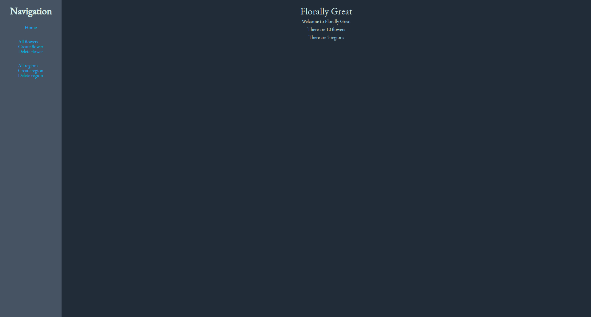

# Florally Great

Flower-themed CRUD operations on a MongoDB database using mongoose and express.

## Technologies Used

- Node
- Mongoose
- Typescript
- Express
- Jest
- Pug
- Parcel

## Retrospective

My main takeaway from Florally Great is dealing with bad code, knowing to only touch already working code when its relevant to the currently in progress feature. Reining in the urge to refactor the whole thing, code doesn't rust after all. This arises from initially starting this in JavaScript and coming back to it a better programmer after a long hiatus.

